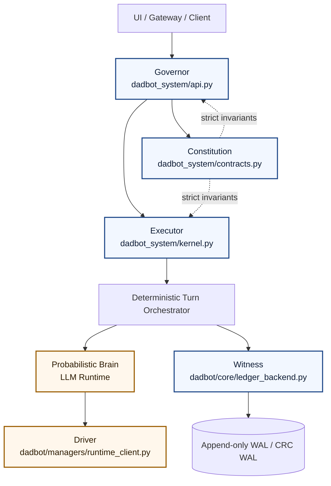

# Ring-0 Essential Audit

This document is a fast orientation map for a second observer reviewing the 2026 kernel split.

## Essential Audit File List

1. Governor: `dadbot_system/api.py`
- Owns service ingress and policy gates.
- Implements Veto-Proxy controls (`DADBOT_VETO_PROXY_ENABLED`, drift threshold).
- Implements SB 243 safe-mode short-circuits (crisis-term detection + negation patterns).
- Enforces auth, tenant isolation, and rate limits before execution dispatch.
- Drives the task barrier via lifecycle-managed scheduler/control-plane startup and shutdown.

2. Executor: `dadbot_system/kernel.py`
- Owns deterministic async lifecycle primitives.
- `KernelTaskManager` tracks task completion/failure to avoid unretrieved async exceptions.
- `Scheduler` serializes turn execution per session while allowing cross-session concurrency.
- `ControlPlane` boundary is the execution platform API surface used by service layer.

3. Constitution: `dadbot_system/contracts.py`
- Defines normalized request/response/event contracts for strict boundary validation.
- Canonicalizes tenant/channel identity (`normalize_tenant_id`, `normalize_channel_name`).
- Standardizes typed envelopes (`ChatRequest`, `ChatResponse`, `EventEnvelope`, `ExecutionGraph`).

4. Driver: `dadbot/managers/runtime_client.py`
- Owns LLM execution path and fallback logic (LiteLLM -> Ollama).
- Contains canonical nested-client cleanup for Ollama async resources:
  - `safe_close_ollama_async(client)` unwraps `client._client` when needed.
  - Awaits `aclose()` when available, falls back to `close()` safely.
- Includes module-level and instance-level shutdown paths to prevent socket transport leaks.

5. Witness: `dadbot/core/ledger_backend.py`
- Defines non-repudiation-oriented persistence tiers for execution events.
- Provides append-only WAL implementations (`FileWALLedgerBackend`, `CRCFileWALLedgerBackend`).
- Supports fsync durability semantics for committed event classes.
- Provides corruption-tolerant replay for crash recovery bootstrap.

## 2026 Ring-0 Architecture

### Why this is not a basic chatbot

- Probabilistic components (LLM behavior) are isolated behind deterministic kernel boundaries.
- Strict contracts and policy gates can veto or short-circuit before model execution.
- Execution is observable and replayable through ledgered event persistence.
- Lifecycle and task management are explicit, not implicit side effects.

## Senior-Priority Wrap Sequence

1. Streamlit smoke stabilization
- Make smoke tests assert UI surface availability only.
- Avoid coupling smoke readiness to model warmup or heavy ledger init.

2. Soak lane warning sweep
- Run soak with warning visibility enabled first.
- If warning output stays clean under long-run load, resource cleanup is likely production-grade.

3. Lint liquidation
- Run automated first pass (`ruff --fix`) for low-risk cleanup.
- Follow with strict typing phase (`pyright` or `mypy`) to drive toward zero-output type checks.
